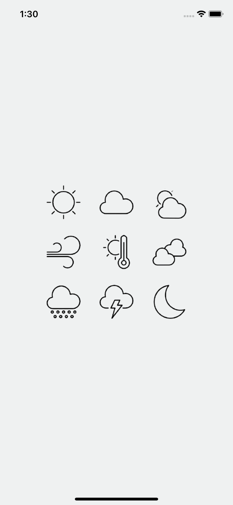

# Weather App - React Native

  

WeatherApp is an app made using the [React Native](https://reactnative.dev/) which has as its main feature the consumption of the user's current location and display of an interface with the region's climate data. The app also has the feature of searching climate data from a city entered by the user.

Weather data are obtained from: https://openweathermap.org/

  

## Table of content
- [Installation](#installation)
- [How to use](#how-to-use)
- [Screenshots](#screenshots)
- [Libraries](#libraries)

## Installation
For the app installation process, first you need to install the project dependencies and then specific configurations for each platform (if any).

* `yarn install` (project dependencies)
* `cd ios` (iOS dependencies )
* `pod install` (iOS dependencies )
* `cd ..` (iOS dependencies )
* `yarn start` (start metro)

In another terminal
* `yarn android` (run android)
* `yarn ios` (run ios - xcode compatible computer required)

## How to use
As soon as the app starts, access to the geolocation service will be requested. After permission is granted, the app will access the latitude and longitude of the device's current location and then, search for the weather data referring to that latitude and longitude. 
The app can also search the weather data passing only the name of the desired city, for that, just access the upper right corner and type the name of the city in the indicated place and then, press the "search" button, the search result will be displayed on the screen main.
To clear the entire information history, just press "clear" in the top left menu, the data will be erased and a new search will be made using the device's current location.

## Screenshots

  
  
  
  
  

## Libraries
The main libraries used to build this application were:
* `@react-native-community/geolocation`: location services
* `@react-navigation/stack`: navigation structure in the app
* `axios`: requests for the weather data endpoint
* `date-fns`: date and time handler
* `react-native-linear-gradient`: gradient background
* `styled-components`: component styling
