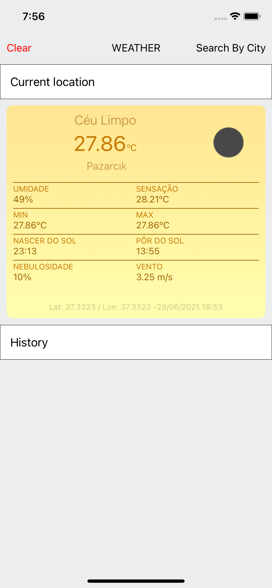
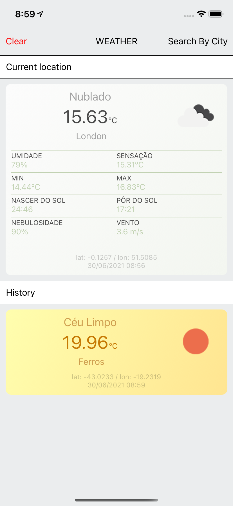
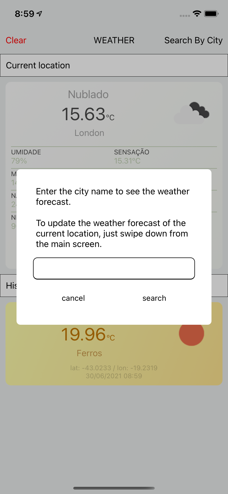
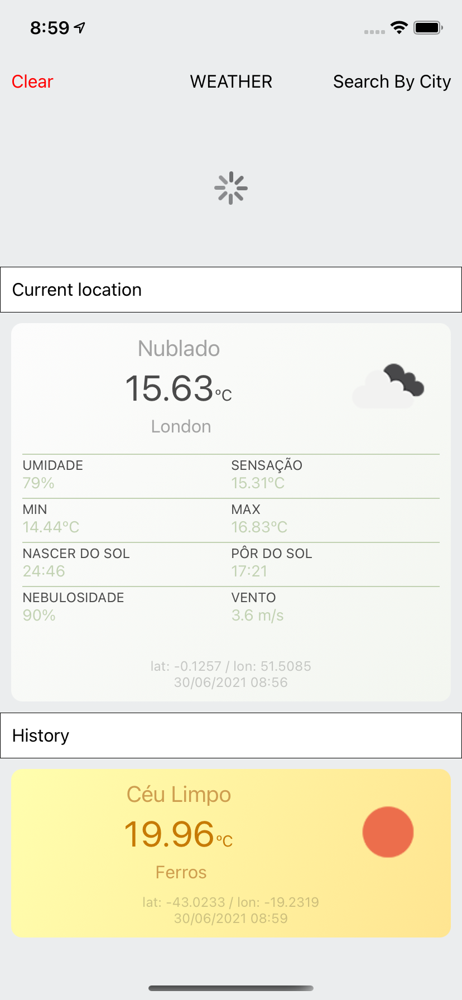

# Weather App - React Native

  

WeatherApp is an app made using the [React Native](https://reactnative.dev/) which has as its main feature the consumption of the user's current location and display of an interface with the region's climate data. The app also has the feature of searching climate data from a city entered by the user.

Gif do uso

## Table of content
- [Installation](#installation)
- [How to use](#how-to-use)
- [Screenshots](#screenshots)
- [Libraries](#libraries)

## Installation
For the app installation process, first you need to install the project dependencies and then specific configurations for each platform (if any).

* `yarn install` (project dependencies)
* `cd ios` (iOS dependencies )
* `pod install` (iOS dependencies )
* `cd ..` (iOS dependencies )
* `yarn start` (start metro)

In another terminal
* `yarn android` (run android)
* `yarn ios` (run ios - xcode compatible computer required)

## How to use
Escrever aqui
## Screenshots

  
  
  
  

## Libraries

* Bibliotecas aqui
